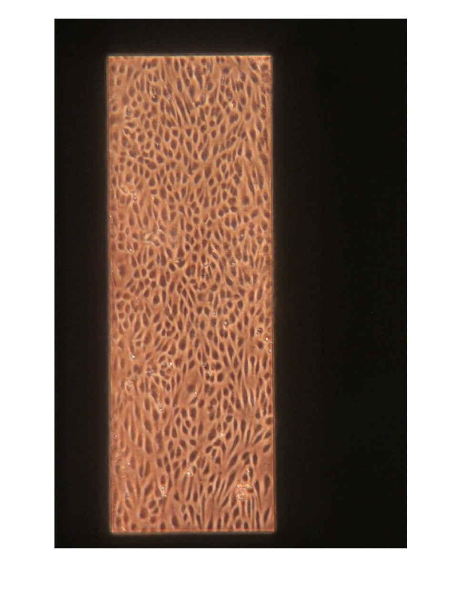
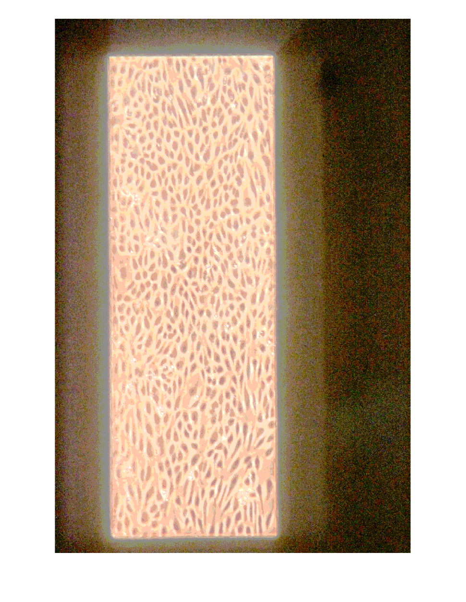
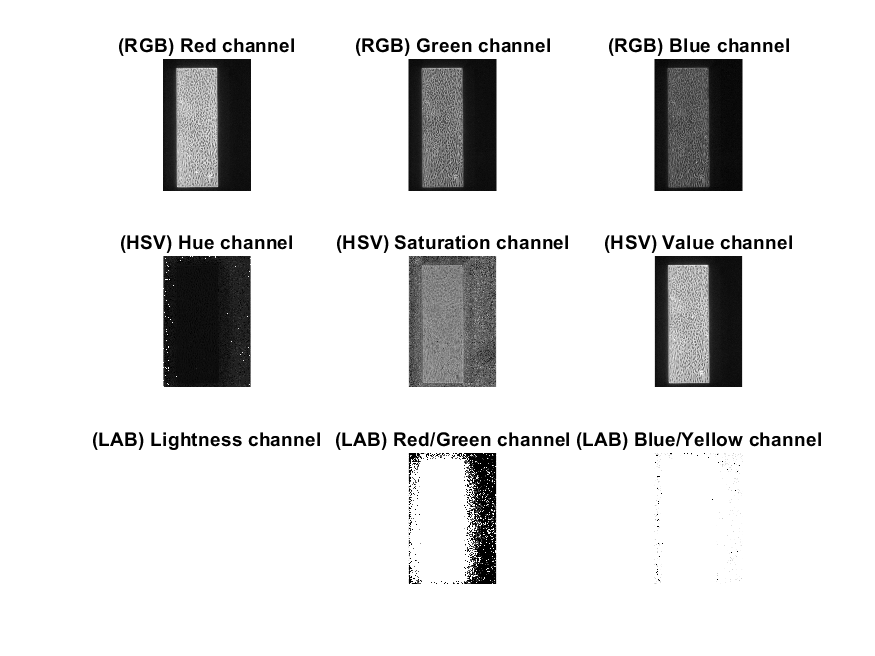
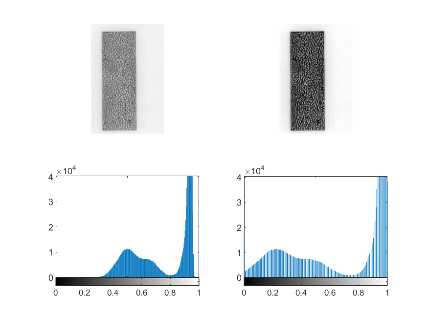
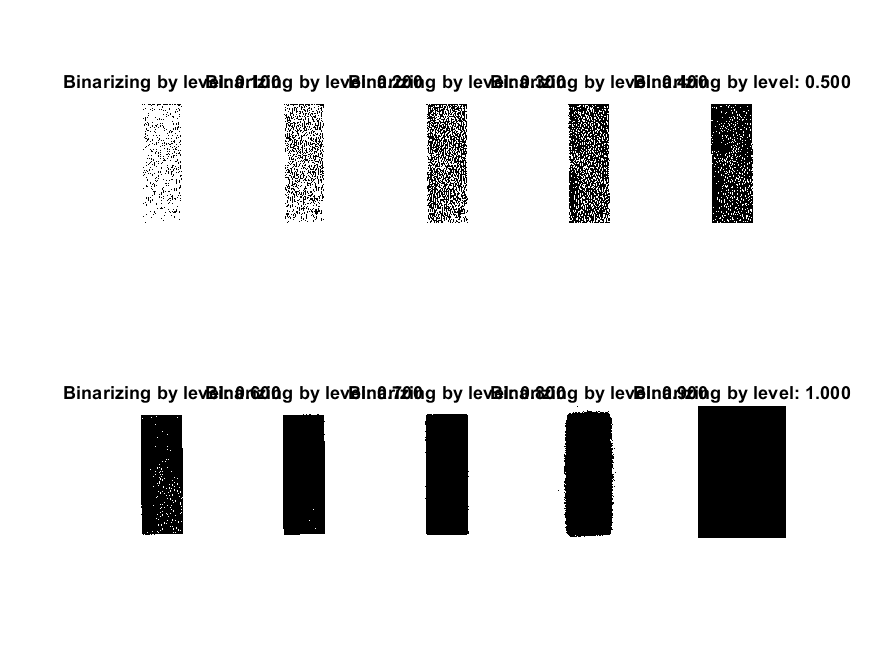
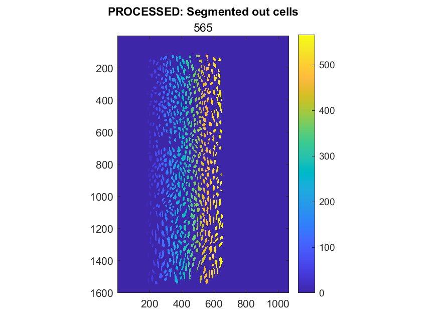
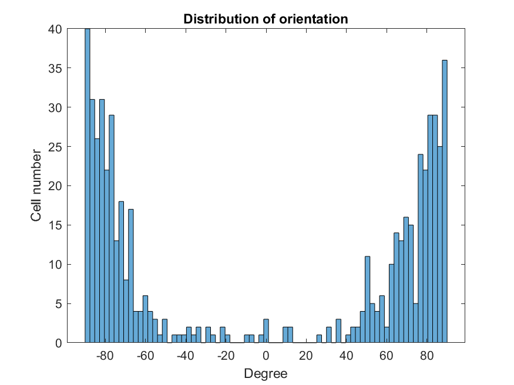

# BBB_Cell_Analysis
Image processing pipeline to segment and analyze blood-brain-barrier (BBB) cell images

##Problem
The goal of the pipeline is to segment, identify individual cells in the image, and analyse orientation - this information is important to measure cells' flexibility and strength when external flow is introduced. 

##Solution

The pipeline begins by reading in the input image and displaying it. Then, the pipeline applies histogram equalization to enhance contrast and better distinguish cell features. This processed image is displayed and saved.

  

Next, the pipeline explores the input image in different color spaces to identify the most distinguishable features. Once identified, the pipeline performs image adjustment to enhance these features. The adjusted image is displayed and saved.

 
 

The pipeline then explores different levels of binarization to create a binary image that separates the foreground from the background. The pipeline applies a threshold to segment out the white space in the background, which is displayed and saved.

 

Next, the pipeline labels all the segmented cells and displays the labeled image. The pipeline then performs post-processing to clear out objects with areas smaller than 100, which is also displayed and saved.

Finally, the pipeline finds the orientation of each cell with respect to x-axis and generates a histogram of cell orientation. This histogram provides valuable insights into the orientation of each cell, which is displayed and saved.

  

Overall, this pipeline provides a powerful tool for analyzing cell images, enabling researchers to identify individual cells and gain insights into their orientation.
